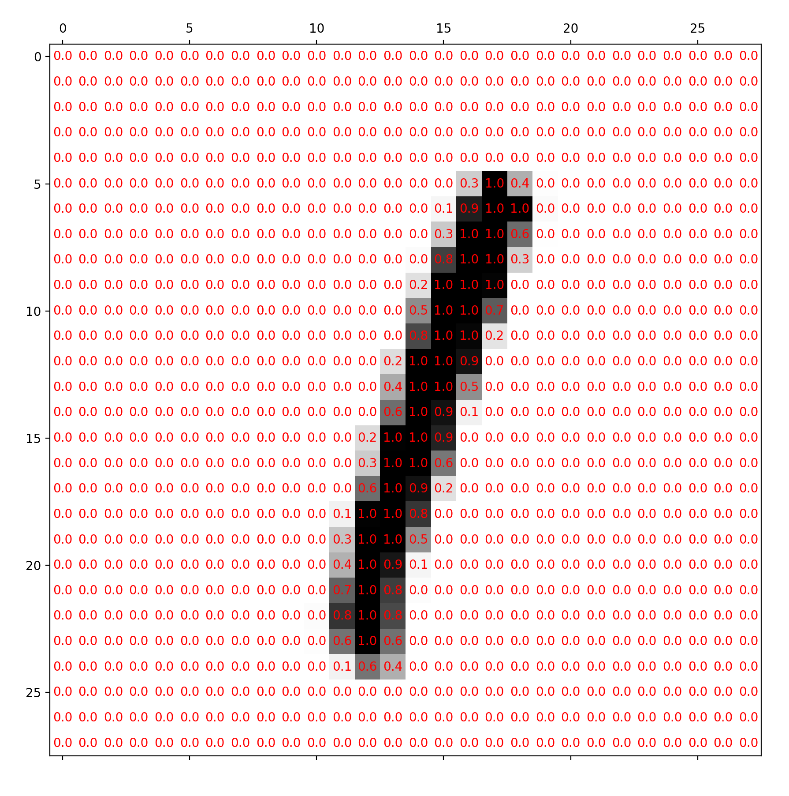
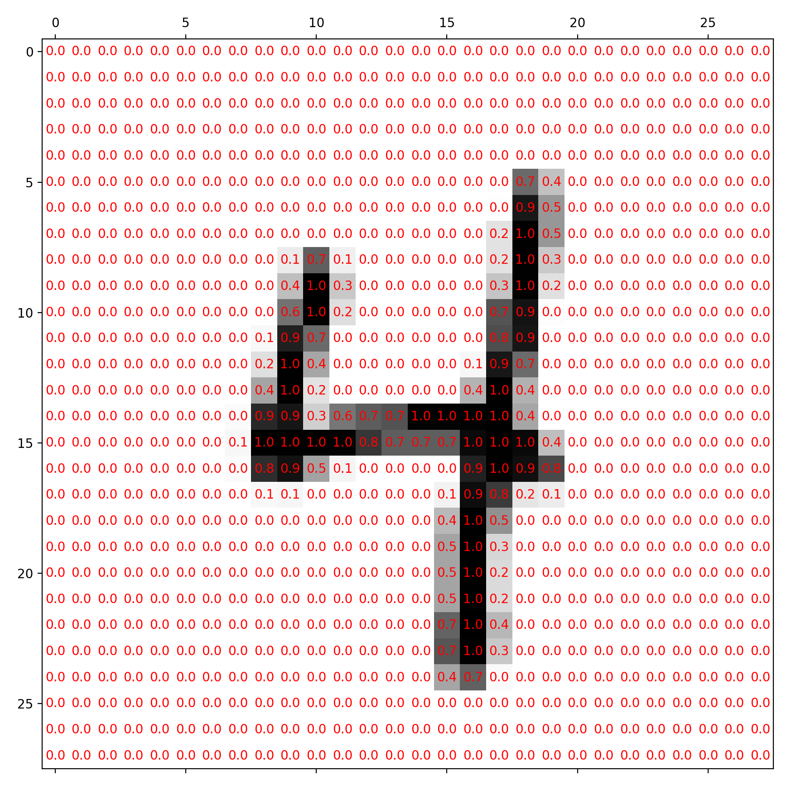
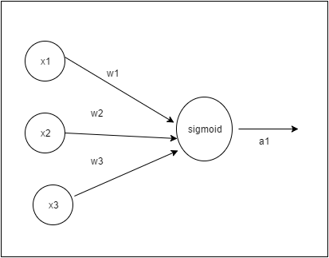
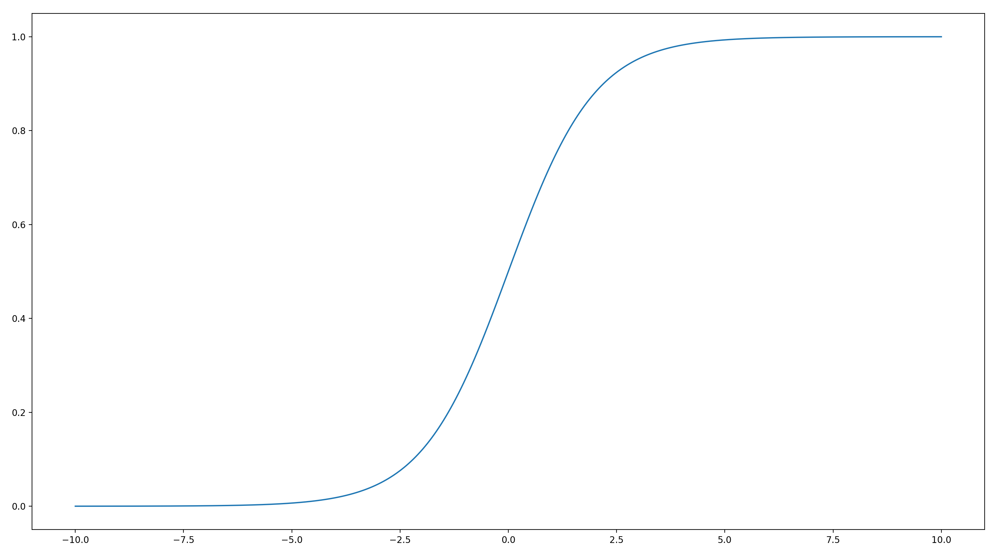
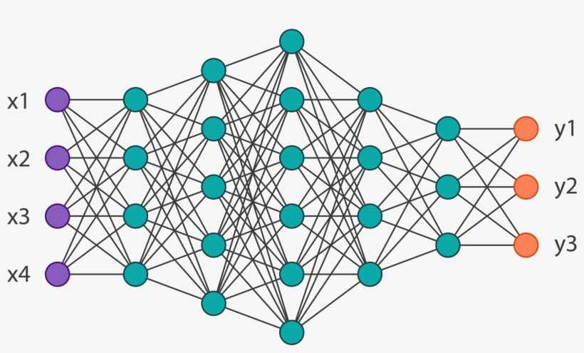

+++
date = '2025-09-18T12:15:23+01:00'
draft = false
title = 'A mathematical introduction to feedforward neural networks'
+++
The introduction of feedforward neural networks and their application to early problems such as recognising handwritten digits from the MNIST dataset was a landmark achievement. Despite their limited standalone use today, they still remain the backbone of various models of wide range of modern architectures Incredibly, the backpropagation algorithm, which only started gaining traction in the 1980's, is still used when updating the billions of trainable parameters in the massive LLMs we see today.

This post aims to give a mathematical description of what a feedforward neural network is, and how it can be trained. It assumes some basic knowledge in single and multivariable calculus, including the chain rule for partial derivatives, and some basic knowledge of matrices.

***
## Defining the problem

We first need to know what this network is even meant to do! For now, we will focus on the classic task of recognising handwritten greyscale digits as an example.

More generally, we focus on tasks which involve **classification**. Given some inputs, we want to be able to classify them into different categories based on their attributes.

The images come from a dataset called **MNIST**. Without going into any of its history, it is a dataset consisting of handwritten digits from 0-9 on a 28x28 grid, each image coming with a label telling us which number the pixels show. The images and labels are split into 2 separate datasets, the first to be used for training the model, and the second to be used for testing how well the model can classify drawings of digits it has never seen before. 

The images are represented as a 28x28 grid of numbers between 0 and 255 inclusive, where each number refers to the intensity of a particular pixel on the grid.

The examples below shows how the pixel values match their corresponding intensities:

Here, I've already normalised all of the values by dividing them by 256 which is how they would actually be passed into the network (but mainly so they fit inside the image).

Before we see how a neural network attempts to 'solve' this classification problem, it is important to define what the neural network even is.

***
## The neuron

The neuron is the most fundamental "building block" of a neural network. It takes some inputs, and maps them to a single output, which is somehow meant to "encode" some sort of information about the inputs. 

Each neuron has associated with it $n$ weights, which we denote $w_1,...,w_n$ for now, where $n$ is the number of inputs to the neuron. It also has a single bias, $b$. 

We can collectively refer to the weights and biases as parameters. When we train a neural network, we are actually just modifying the weights and biases of the many neurons in the network to achieve some sort of desired behaviour on inputs feeded into the network.

We define the function $\sigma(z)$ as follows:  
$$\sigma(z)=\frac{1}{1+e^{-z}}$$

Given some $n$ inputs $x_1,...,x_n$, the output $a$ of the neuron is:  
$$a=\sigma(w_1x_1+...+w_nx_n+b)$$

Or more compactly:  
$$a=\sigma\left(\sum{w_ix_i}+b\right)$$

where the summand is taken to be over all the inputs.

The visual representation below is commonly used:

With networks containing loads of these neurons (and therefore loads of connections), writing out the weights on each individual connection will clutter up the image, so they are usually omitted. 

This representation allows us to give a nice graph-like representation of the data flowing through a neural network when we actually start constructing them.

From just looking at the formula, there is quite a bit to break down!

WIthout worrying about the $\sigma$ for the moment, the inside sum is a weighted sum of the inputs $x_i$, with the various $w_i$. The bias term is then added on, leaving us with what we call the **weighted input** to the neuron:

$z=\sum{w_ix_i} + b$

This "intermediate" quantity turns out to be incredibly useful when we start training the network, but more on that later...

After that, we apply the function $\sigma$ to this weighted input, leaving us with the final output of the neuron, $a=\sigma(z)$. 

In this context, the sigmoid function acts as an **activation function**. There are many other possibilities for the activation function, such as hyperbolic tangent or ReLU, which have generally seen better results in practice, but for now, we will just stick with the sigmoid.

The function $\sigma(z)$ we defined above is the sigmoid function. There are a few useful and important properties we can deduce about it. It may help to look at a graph sketch of the output of the sigmoid vs its input, which is shown below:

It isn't too hard to show it is increasing, and we can see that its gradient *vanishes* as $z$ becomes either very large or very small. This is actually really important, as we see later.

It can be verified algebraically that we have the relation:

$\sigma'(z)=\sigma(z)(1-\sigma(z))$

(where ' stands for differentiation w.r.t. the input as usual), which turns out to help when motivating the definition of **cross-entropy loss**. But again, more on that later...

It can also be easily verified that $\sigma(z)$ is bounded between 0 and 1, and is close to 0 for very negative values of $z$, and close to 1 for very positive values of $z$.

***
## Defining the network

Now we are ready to define what a neural network is.

A neural network has an **input layer** and an **output layer**. When using the network as a classifier after training, we can think of the network as a function which maps inputs (placed into the input layer) to outputs (from the outputs layer). Between them, there are **hidden layers**. They are placed in the following arrangement:

The number of neurons in each layer will obviously be different in a neural network for classifying MNIST images (it would have 784 inputs and 10 outputs for example).

Note that the neurons in a particular layer are each connected to every output from the previous layer. For this reason, these layers are also referred to as fully-connected layers.

(Technically, the input layer doesn't really use neurons, but it still makes sense to use the notation $a^1$ to denote the input we feed into the first hidden layer).

The input to the neural network is fed into the first of these layers. The outputs of the first layer of neurons is computed and passed onto the next layer. This continues until we reach the output layer of neurons. With a well-trained network, we should see the outputs from the final layer can easily be "interpreted" to decide on a correct label for our input.

This is still a bit too imprecise! Let's work through how this would work for a classifier on the MNIST handwritten digit dataset.

Due to the "flatness" of the layers, we first flatten the 28x28 image into a list of length 784 to pass into the network (in practice we would also normalise the pixel values to lie between 0 and 1). This is the input to our network. The output of the network should be a layer containing 10 neurons, which should each correspond to a label (from 0-9).

We will train the network a way such that the label which the network chooses is decided from the largest output from the output layer neurons. In an ideal case (remembering the range of the sigmoid function), we would expect to see a "1" output from the neuron matching the correct label, and a "0" everywhere else.

***
## Defining our notation

Going back to a more general case, suppose we have a neural network consisting of some layers of neurons. We will use $L$ to denote the number of layers, and label them from 1 to $L$ inclusive.

We will let $z^l_i$ refer to the weighted input to the $i^{\text{th}}$ neuron in the $l^{\text{th}}$ layer and $a^l_i$ to refer to that same neuron's output after applying the activation function, so in particular, we have that:

$$a^l_i=\sigma(z^l_i)$$

We now introduce the notation for the weights and biases. We let:

$$w^l_{i,j}$$

refer to the weight for the $i^{\text{th}}$ neuron in the $l^{\text{th}}$ layer coming from the $j^{\text{th}}$ output from the $l-1^{\text{th}}$ layer. 

We let:

$$b^l_i$$

refer to the bias on the $i^{\text{th}}$ neuron in the $l^{\text{th}}$ layer.

Using this notation, we can now express the weighted input to any neuron in the network (where m is the number of neurons in the previous layer):

$$z^l_i = w^l_{i,1}a^{l-1}_1 + .… + w^l_{i,m}a^{l-1}_m+b^l_i$$

Using the first subscript to denote which neuron the weight is connected to in the "later" layer may seem quite strange at first, but it turns out that it makes everything a lot neater, as we will see now.

You may have noticed that if we pack together the weighted sums of inputs into a vector, it pretty much looks like the result of some matrix-vector product. 

In fact, looking at the weighted inputs to the $l^{\text{th}}$ layer (before applying the bias), we have:

$$
\begin{pmatrix}
w^l_{1,1}a^{l-1}_1+~...~+w^l_{1,m}a^{l-1}_m\\
w^l_{2,1}a^{l-1}_1+~...~+w^l_{2,m}a^{l-1}_m\\
\vdots \\
w^l_{n,1}a^{l-1}_1+~...~+w^l_{n,m}a^{l-1}_m
\end{pmatrix}=
\begin{pmatrix}
w^l_{1,1} & w^l_{1,2} & \dots & w^l_{1,m} \\
w^l_{2 ,1} & w^l_{2,2} & & \vdots \\
\vdots & & \ddots & \vdots \\
w^l_{n,1} & \dots & \dots & w^l_{n,m}
\end{pmatrix}
\begin{pmatrix}
a^{l-1}_1 \\
a^{l-1}_2 \\
\vdots \\
a^{l-1}_m \\
\end{pmatrix}$$

where $m$ is the number of neurons in the $l-1^{\text{th}}$ layer and $n$ is the number of neurons in the $l^{\text{th}}$ layer.

This is why our "backwards" subscripts on the weights are nice - we can express the forwards pass as a matrix multiplication with a **weight matrix**, where the weights are packed into the matrix with the standard method for indexing.

In practice, it is useful to write this computation as a matrix multiplication as libraries with linear algebra capabilities are often optimised to perform these operations very quickly.

If we define the weights between layers $l$ and $l-1$ (which have $n$ and $m$ neurons like before):

$$w^l=\begin{pmatrix}
w^l_{1,1} & w^l_{1,2} & \dots & w^l_{1,m} \\
w^l_{2 ,1} & w^l_{2,2} & & \vdots \\
\vdots & & \ddots & \vdots \\
w^l_{n,1} & \dots & \dots & w^l_{n,m}
\end{pmatrix}$$

and the biases for layer $l$:

$$b^l = \begin{pmatrix}
b^l_1 \\
b^l_2 \\
\vdots \\
b^l_n
\end{pmatrix}$$

We now have a very compact way to express the weighted inputs to a layer given the outputs from a previous layer:

$$z^l=w^la^{l-1}+b^l$$

If for $z$ a matrix/vector we define $\sigma(z)$ to mean applying $\sigma$ to each individual entry in $z$, we have:

$$a^l=\sigma(z^l)=\sigma(w^la^{l-1}+b^l)$$

Now, given an input $x=a^1$, we can repeatedly apply this above expression (as $l$ ranges from 2 to $L$) to get an output. This is known as a **forward pass** through the network. We now need to know how to modify the weights and biases in the network to allow it to succeed in classifying objects.

***
## The cost function

The cost function is a measure of how "far away" our network is from its desired behaviour. 

We let $x$ be an input to our network, and $y$ to be the desired output. For MNIST, this desired output is constructed from the label which is included with the dataset for each image.

More precisely, if the image label is $i$, where $0\le i\le9$, then the desired output of the network $y$ is a column vector of length 10, with a "1" in the $i^{\text{th}}$ position and "0"s everywhere else. 

For example, if the label is "3", then we would have:

$$y=\begin{pmatrix}
0 \\
0 \\
0 \\
1 \\
0 \\
0 \\
0 \\
0 \\
0 \\
0 \\
\end{pmatrix}$$

Recalling that the output of our network is $a^L$ (which is also clearly dependent on $x$), the cost function should be a measure of similarity between $y$ and $a^L$. It should be large when they are very different, and small when they are very similar.

A very natural choice is the squared Euclidean distance between $y$ and $a^L$ (treating them as vectors in $\mathbb{R}^n$ where $n$ is the size of the output layer):

$$C=\sum{(y_i-a^L_i)^2}$$

Training the network using this **quadratic cost** does work, but in practice, another cost function called the **cross entropy loss** works better with sigmoid neurons for reasons we will get into later.

In our MNIST example, the training data consists of a large number of examples. The goal of training can now be restated more formally - we aim to change the weights and biases in the network to **minimise** the cost function:

$$C=\frac{1}{n}\sum_{\forall x}C_x$$

Here, each $C_x$ is the cost from each training example (which is clearly only dependent on $x$) and $n$ is the number of training examples. We are trying to minimise the average loss from all of the examples.

***
## Gradient descent and SGD

Recall that given some function $f$ in multiple independent variables $x_1,x_2,...,x_n$, the gradient vector is given by:

$$\nabla f(x_1,...,x_n)=\begin{pmatrix}
\frac{\partial f}{\partial x_1} \\
\vdots \\
\frac{\partial f}{\partial x_n} \\
\end{pmatrix}$$

At some given point $x=(x_1,...,x_n)$, the gradient vector is the direction of greatest increase of $f$ (at least locally). The direction of greatest *decrease* in $f$ is in the opposite direction to the gradient vector. This is what we will be using in gradient descent.

Both of these results can be derived from the fact that locally, at a given point $x_0=(x_1,...,x_n)$, $f$ can be approximated by a "tangent" plane:

$$f(x)\approx f(x_0)+\nabla f \cdot (x-x_0)$$

where $x$ represents a general point in $n$-dimensional space.

This dot product (given the size of the step $\left\lVert x-x_0\right\rVert$ is held constant) is maximised precisely when the displacement of a point from the initial position $x_0$, given by $x-x_0$, points exactly in the direction of the gradient vector, and minimised exactly when $x-x_0$ points in the opposite direction to the gradient vector.

The direction of the gradient vector for a general function is going to change as we change its inputs. The idea of **gradient descent** is to take small steps in the opposite direction of the gradient vector, so we end up taking a "downhill" path to points where the function is smaller.

This is an iterative process, where we repeatedly modify the input to the function $x=(x_1,...,x_n)$ according to the following formula:

$$x\rightarrow x-\eta\nabla f$$

$x$ is getting updated by making a small step in the opposite direction of the gradient vector ($-\eta\nabla f$). Here, $\eta$ is a parameter which controls how large the step size is, known as the **learning rate**.

In our case, we can treat our cost function $C$ as being a function of all of the weights and biases in the network. This is because we are already fixing all of our various inputs to the network during training (the $x$'s), and it is now up to us to modify the parameters.

Following our gradient descent formula above, looking at the weights and biases individually gives the following formulae for updates (for a single weight/bias):

$$w_k\rightarrow w_k-\eta\frac{\partial C}{\partial w_k}$$
$$b_k\rightarrow b_k-\eta\frac{\partial C}{\partial b_k}$$

Recall that we sum over the costs for each input to define the final cost function $C$:

$$C=\sum_{\forall x}C_x$$

By the linearity of derivatives, for any weight or bias, we have:
$$\frac{\partial C}{\partial w_k}=\frac{1}{n}\sum_{\forall x}\frac{\partial C_x}{\partial w_k}$$
$$\frac{\partial C}{\partial b_k}=\frac{1}{n}\sum_{\forall x}\frac{\partial C_x}{\partial b_k}$$

In other words, we can just compute the cost gradients for each training example and sum over all of them to compute the final gradients for each parameter to be used in the update.

In practice however, this is painfully inefficient. For just a single step, we require *the entire dataset to be processed*. Keep in mind that even MNIST has 60,000 training images.

Instead of computing gradients for all of the training data, we instead do it in small batches. The idea is that (after some rescaling) this *approximation* of the cost function will result in gradients for the parameters which are roughly in the same "direction" as if we used all of the training data. 

To be a bit more precise, let $x_1,...,x_m$ be a sampled mini-batch of inputs, where $m$ is the mini-batch size. As an example, I used $m=20$ when training my network. We then approximate the derivatives of $C$ by taking an average over the gradients from our mini-batch:

$$\frac{\partial C}{\partial w_k}\approx\frac{1}{m}\sum_{i=1}^m\frac{\partial C_i}{\partial w_k}$$
$$\frac{\partial C}{\partial b_k}\approx\frac{1}{m}\sum_{i=1}^m\frac{\partial C_i}{\partial b_k}$$

In practice, this works incredibly well and even helps the gradient descent method escape from local minima. This technique of using mini-batches to update gradients is known as **stochastic gradient descent (SGD)**.

I've missed out a pretty important detail - how are we even meant to compute the partial derivatives of the cost w.r.t. the various weights and biases in the network? After all, the layered structure of the network seems to make things very complicated. 

It turns out that there is an algorithm called **backpropagation** which allows us to do these gradient computations very quickly in a very understandable and elegant way!

***
## Backpropagation

The goal of backpropagation is to compute the partial derivatives of the cost function for a single training example w.r.t. the parameters in the network. 

For this section, I will use $C$ to refer to the cost for a single training example (as opposed to earlier where it was used to denote the average cost across all training examples), and we will minimise $C$ as a function of the parameters of the network (we obviously don't get to tamper with the training data!).

I mentioned before that the **weighted input** to a neuron $z^l_i$ would be useful later. We define the **error** of the $i^{\text{th}}$ neuron in the $l^{\text{th}}$ layer as follows:

$$\delta^l_i=\frac{\partial C}{\partial z^l_i}$$

Using a similar notation to before, we will let:

$$\delta^l$$

refer to a vector containing all of the errors in a given layer.

It turns out that to compute the gradients for the weights and biases, computing the "intermediate" error term simplifies things a lot!

Before we continue, there is an important notation we need to introduce:

***
### The Hadamard product

The **Hadamard product** (also called the Schur product) is an an operation defined between 2 matrices or 2 vectors with the same dimensions, which maps it to a matrix/vector of the same dimensions as the input. If $a$ and $b$ are our 2 inputs, their Hadamard product is denoted:

$$a \odot b$$

To compute it, we multiply each element in the first matrix/vector with its corresponding element in the second matrix/vector. To illustrate with an example, let:

$$a=\begin{pmatrix}
1 \\
2 \\
3\end{pmatrix},
b=\begin{pmatrix}
4 \\
5 \\
6\end{pmatrix}$$

Then:

$$a\odot b=
\begin{pmatrix}
1\times 4 \\
2\times 5 \\
3\times 6\end{pmatrix}
=\begin{pmatrix}
4 \\
10 \\
18\end{pmatrix}$$

***
We can now outline our plan to compute the gradients of the cost w.r.t. the weights and biases. We first compute the errors of all the neurons, and it turns out that there is a very neat way to do this. Then, once we have computed the errors, we can compute the weight and bias gradients from them nicely. This completes our goal - now these gradients can be used in the gradient descent process to update the parameters of the network to lower the cost function.

This entire process can be condensed into **4 equations**, which we will derive now. If you are comfortable with the chain rule for multiple variables, I encourage you to try deriving these on your own.

***
### 1: Errors in the output layer

The errors in the output layer $\delta^L$ are clearly going to dependent on our choice of cost function. We claim that:

$$\delta^L=\nabla_a C\odot \sigma'(z^L)$$

Here, we are treating $C$ as a function of only the outputs of the output layer of neurons $a^L$. This means that $\nabla_a C$ is a gradient vector "with respect to" the outputs of the network. To be more concrete, we have (where $n$ is the number of output neurons):

$$\nabla_a C=\begin{pmatrix}
\frac{\partial C}{\partial a^L_1} \\
\vdots \\
\frac{\partial C}{\partial a^L_n}\end{pmatrix}$$

#### Proof

We treat $C$ as a function of the various outputs in $a^L$, $C=C(a^L_1,...,a^L_n)$. By chain rule, we have:

$$\frac{\partial C}{\partial z^L_k}=\sum_{i=1}^n\frac{\partial C}{\partial a^L_i}\frac{\partial a^L_i}{\partial z^L_k}$$

However, notice that when $k\ne i$, the partial derivative:

$$\frac{\partial a^L_i}{\partial z^L_k}$$

ends up vanishing as this output $a^L_i$ is independent of the weighted input $z^L_k$ which is at a different neuron. Now we are only left with the term in the sum with $i=k$, which leaves:

$$\frac{\partial C}{\partial z^L_k}=\frac{\partial C}{\partial a^L_k}\frac{d a^L_k}{d z^L_k}$$

where it's fine to write the second term is an ordinary derivative as we have already defined $a^L_k=\sigma(z^L_k)$. Rewriting in our notation:

$$\delta^L_k=\frac{\partial C}{\partial a^L_k}\sigma'(z^L_k)$$

for each $k$. This is a formula for the individual components of our error vector and it can now be easily verified that the formula which we claimed above is true.

#### Output layer errors with quadratic loss

Again, if you haven't done so before, I would encourage you to try deriving this result on your own first. Recall that given a target label $y$ and the output of our network $a^L$, our quadratic loss was defined by:

$$\sum_{i=1}^n(y_i-a^L_i)^2$$

For any particular $a^L_k$, we have:

$$\frac{\partial C}{\partial a^L_k}=2(a^L_i-y_i)$$

It is not hard now to verify that in the case of quadratic loss,

$$\nabla_a C=2(a^L-y)$$

Subbing back in:

$$\delta^L=2(a^L-y)\odot \sigma'(z^L)$$

***
### 2: Errors in a layer from errors in the next layer

We claim that (at least for $l<L$):

$$\delta^l=((w^{l+1})^T\delta^{l+1})\odot\sigma'(z^l)$$

Here, the $T$ denotes a matrix transpose. Note that as $w^{l+1}a^l$ is used to compute $a^{l+1}$, their shapes are the same. The errors in a layer must have the same shape as the outputs. In other words, we have that $w^{l+1}\delta^l$ has the same shape as $\delta^{l+1}$. This also tells us that $\delta^l$ and $(w^{l+1})^T\delta^{l+1}$ have the same shape, which at least verifies that this formula is "dimensionally" correct.

#### Proof

Here, we will treat $C=C(z^{l+1}_1,...,z^{l+1}_n)$ as a function of the $n$ weighted inputs to the $(l+1)^{\text{th}}$ layer. This is a natural choice, as we will get the nice $\delta^{l+1}_i$-type terms when we start applying the chain rule. Doing just that:

$$\frac{\partial C}{\partial z^l_k}=\sum_{i=1}^n\frac{\partial C}{\partial z^{l+1}_i}\frac{\partial z^{l+1}_i}{\partial z^l_k}$$

The second term $$\frac{\partial z^{l+1}_i}{\partial z^l_k}$$ can be chain-ruled again by using $a^l_k$ (noting all of the other partial derivatives which may appear vanish for the same reason as in our previous proof), which gives:

$$\frac{\partial C}{\partial z^l_k}=\sum_{i=1}^n\frac{\partial C}{\partial z^{l+1}_i}\frac{\partial z^{l+1}_i}{\partial a^l_k}\frac{d a^l_k}{d z^l_k}$$

Now recalling how $z^{l+1}_i$ is a weighted input of the $m$ various $a^l_j$s:

$$z^{l+1}_i=\sum_{j=1}^m(w^{l+1}_{i,j}a^l_j)+b^{l+1}_i$$

We can compute the partial derivative $\frac{\partial z^{l+1}_i}{\partial a^l_k}$ in our sum:

$$\frac{\partial z^{l+1}_i}{\partial a^l_k}=w^{l+1}_{i,k}$$

as all of the other terms are independent of $a^l_k$ so taking partial derivatives causes them to vanish. Subbing this back in and rewriting the other 2 partial derivatives in the summand in a more useful way:

$$\frac{\partial C}{\partial z^l_k}=\sum_{i=1}^n\delta^{l+1}_i w^{l+1}_{i,k}\sigma'(z^l_k)$$

And factorising out the $\sigma'$ term which is held constant throughout the sum for neatness:

$$\frac{\partial C}{\partial z^l_k}=\sigma'(z^l_k)\sum_{i=1}^n\delta^{l+1}_i w^{l+1}_{i,k}$$

This is a formula for the components of the error vector in the $l^{\text{th}}$ layer. This "collection" of sums can be represented concisely as a matrix product (the formula above), which I leave you to verify :)

***
### 3: Bias gradients from errors

We claim (for $l\ge 2$ as the input layer doesn't have any parameters attached to it):

$$\frac{\partial C}{\partial b^l_j}=\delta^l_j$$

We haven't really defined any notation yet for a vector storing the bias gradients. The cost can't be written to only be dependent on the biases in a single layer, which makes a gradient vector notation seem wrong.

#### Proof
Thankfully, this is probably the formula with the shortest proof. We consider the weighted input $z^l_j$, which is given by the formula (where $n$ is the number of neurons in the $l-1^{\text{th}}$ layer):

$$z^l_j=\sum_{i=1}^n(w^l_{j,i}a^{l-1}_i)+b^l_j$$

Clearly, the partial derivative $\frac{\partial z^l_j}{\partial b^l_j}$ is equal to 1. By chain rule again, treating $C=C(z^l_1,...,z^l_m)$ as a function of the various $z^l_i$s and discarding the terms in the sum which have a partial derivative which vanishes from being independent of this bias, we get:

$$\frac{\partial C}{\partial b^l_j}=1\times\frac{\partial C}{\partial z^l_j}=\delta^l_j$$

which is the desired result.

***
### 4: Weight gradients from errors

We claim:
$$\frac{\partial C}{\partial w^l_{j,k}}=a^{l-1}_k\delta^l_j$$

#### Proof
Again, let's treat $C=C(z^l_1,...,z^l_m)$ as a function of the various $z^l_i$s. Using:

$$z^l_j=\sum_{i=1}^n(w^l_{j,i}a^{l-1}_i)+b^l_j$$

again, differentiating w.r.t. $w^l_{j,k}$ gives (after ignoring vanishing terms):

$$\frac{\partial z^l_j}{\partial w^l_{j,k}}=a^{l-1}_k$$

Using the chain rule similarly above gives:

$$\frac{\partial C}{\partial w^l_{j,k}}=\frac{\partial C}{\partial z^l_j}\frac{\partial z^l_j}{\partial w^l_{j,k}}=\delta^l_j a^{l-1}_k$$

which is the desired result.

***
### In summary

We have the following 4 equations:

$$
\begin{align}
& \delta^L=\nabla_a C\odot \sigma'(z^L) \\
& \delta^l=((w^{l+1})^T\delta^{l+1})\odot\sigma'(z^l) \\
& \frac{\partial C}{\partial b^l_j}=\delta^l_j \\
& \frac{\partial C}{\partial w^l_{j,k}}=a^{l-1}_k\delta^l_j
\end{align}
$$

***
## Outlining the training process

We now have backpropagation as a way to compute gradients, so we are ready to outline how the network can be trained. It can be summarised in  a few steps:

- Randomly generate minibatches of training examples (of size $m$).
- For each minibatch of training examples $x_1,x_2,...,x_m$:
    - Pass each $x_i$ forwards through the network.
        - Set $a^1=x_i$
        - Repeatedly compute $a^{l+1}=\sigma(w^{l+1}a^l+b^{l+1})$ until the output layer.
    - Backpropagate the loss:
        - Compute output layer errors:
            - $\delta^L=\nabla_a C\odot \sigma'(z^L)$
        - Compute errors in previous layers:
            - $\delta^l=((w^{l+1})^T\delta^{l+1})\odot\sigma'(z^l)$
        - Compute weight and bias gradients:
            - $\frac{\partial C}{\partial b^l_j}=\delta^l_j$
            - $\frac{\partial C}{\partial w^l_{j,k}}=a^{l-1}_k\delta^l_j$
        - Accumulate this loss over all of the examples in the minibatch
    - Update parameters using the averaged gradients (after dividing by $m$) with gradient descent.
        - Done by using the updates:
            - $w_k\rightarrow w_k-\eta\frac{\partial C}{\partial w_k}$
            - $b_k\rightarrow b_k-\eta\frac{\partial C}{\partial b_k}$

We will go over how this can actually be implemented later :)
